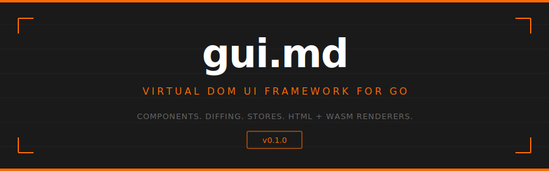

<p align="center">
  
</p>

<p align="center">
  <code>go get github.com/readmedotmd/gui.md</code>
</p>

---

## What is this?

A **virtual DOM UI framework for Go** — build reactive interfaces with composable components, typed state, and structural diffing. Render to **HTML strings** (server-side) or **live DOM** (browser via WebAssembly).

```go
gui.Div(gui.Class("app"))(
    gui.H1()(gui.Text("Hello, gui.md")),
    gui.Button(gui.OnClick(func() { fmt.Println("clicked") }))(
        gui.Text("Click me"),
    ),
)
```

Curried builders, generic components, Zustand-like stores — everything composes.

---

## Features

<table>
<tr>
  <td width="200"><strong>Declarative trees</strong></td>
  <td>Curried element builders: <code>Div(Class("x"))(Text("hi"))</code> — composable, type-safe, no templates</td>
</tr>
<tr>
  <td><strong>Functional components</strong></td>
  <td>Generic <code>FuncComponent[T]</code> with typed props and children. Wrap with <code>Comp()</code> for tree use.</td>
</tr>
<tr>
  <td><strong>Stateful components</strong></td>
  <td>Embed <code>BaseComponent[P, S]</code> for typed props + state, lifecycle hooks, and automatic re-renders.</td>
</tr>
<tr>
  <td><strong>Managed components</strong></td>
  <td><code>C()</code> creates, caches, and reuses instances automatically — preserving state across renders.</td>
</tr>
<tr>
  <td><strong>Global store</strong></td>
  <td>Generic <code>Store[T]</code> with Get/Set/Update and subscriber notifications. Thread-safe.</td>
</tr>
<tr>
  <td><strong>Tree diffing</strong></td>
  <td>Structural diff engine produces minimal patch sets: replace, update props, update text, insert/remove children.</td>
</tr>
<tr>
  <td><strong>HTML renderer</strong></td>
  <td><code>gui/html</code> — deterministic HTML output with sorted attributes, void elements, boolean props, escaping.</td>
</tr>
<tr>
  <td><strong>DOM renderer</strong></td>
  <td><code>gui/dom</code> — live DOM via WASM with event handlers, focus preservation, and <code>requestAnimationFrame</code> batching.</td>
</tr>
<tr>
  <td><strong>Adapter interface</strong></td>
  <td><code>gui/adapter</code> — conforms to <a href="https://github.com/readmedotmd/agent.adapter.md">agent.adapter.md</a> for driving AI agents from the UI.</td>
</tr>
<tr>
  <td><strong>Testing framework</strong></td>
  <td><code>gui/testing</code> — React Testing Library-style API: query by text/role/test ID, simulate clicks and typing, fluent assertions.</td>
</tr>
</table>

---

## Quick Start

### HTML rendering

```go
package main

import (
    "fmt"
    gui "github.com/readmedotmd/gui.md"
    "github.com/readmedotmd/gui.md/html"
)

func main() {
    page := gui.Html()(
        gui.Body()(
            gui.H1()(gui.Text("Hello from gui.md!")),
        ),
    )
    r := html.New()
    fmt.Println(r.RenderString(page))
}
```

### Components

```go
// Functional component — generic, typed props
type NavBarProps struct { Title string }

func NavBar(props NavBarProps, children []gui.Node) gui.Node {
    return gui.Header()(
        gui.H1()(gui.Text(props.Title)),
        gui.Nav()(gui.Frag(children...)),
    )
}

// Use in a tree — T is inferred
gui.Comp(NavBar, NavBarProps{Title: "My App"}, child1, child2)
```

```go
// Stateful component — typed props + state
type CounterState struct { Count int }

type Counter struct {
    gui.BaseComponent[gui.Props, CounterState]
}

func (c *Counter) Render() gui.Node {
    s := c.State()
    return gui.Div()(
        gui.Textf("Count: %d", s.Count),
        gui.Button(gui.OnClick(func() {
            c.UpdateState(func(s CounterState) CounterState {
                s.Count++
                return s
            })
        }))(gui.Text("+")),
    )
}
```

### Store

```go
store := gui.NewStore(AppState{Count: 0, Name: "World"})

store.Update(func(s AppState) AppState { s.Count++; return s })

unsub := store.Subscribe(func(cur, prev AppState) {
    fmt.Printf("count changed: %d -> %d\n", prev.Count, cur.Count)
})
defer unsub()
```

---

## Testing

React Testing Library-style API for integration testing your component trees.

```go
import guitesting "github.com/readmedotmd/gui.md/testing"

func TestLoginForm(t *testing.T) {
    s := guitesting.RenderFunc(renderLoginForm)

    // Query by role, text, placeholder, test ID
    email := s.GetByPlaceholder("Email")
    password := s.GetByPlaceholder("Password")
    submit := s.GetByRole("button")

    // Simulate user interaction
    s.Type(email, "alice@example.com")
    s.Type(password, "secret")
    s.Click(submit)
    s.Rerender()

    // Assert results
    s.Assert(t).
        TextVisible("Welcome, alice@example.com").
        HasNoElement("form")
}
```

### Queries

| Method | Behaviour |
|--------|-----------|
| `GetByText("Submit")` | Panic if not found (like RTL's `getBy*`) |
| `QueryByText("Submit")` | Return nil if not found (like RTL's `queryBy*`) |
| `QueryAllByRole("button")` | Return all matches |
| `GetByTestId("sidebar")` | Find by `data-testid` prop |
| `GetByPlaceholder("Search")` | Find by placeholder prop |
| `Within(ref)` | Scope queries to a subtree |

### Interactions

| Method | What it does |
|--------|-------------|
| `Click(ref)` | Fire `onclick` handler |
| `Type(ref, "text")` | Fire `oninput` per character |
| `Clear(ref)` | Fire `oninput` with empty value |
| `KeyPress(ref, "Enter")` | Fire `onkeypress` |
| `FireEvent(ref, "mouseenter", ev)` | Fire any event |

### Assertions

```go
s.Assert(t).
    TextVisible("Hello").
    HasRole("button").
    ElementCount("li", 3).
    HTMLContains(`class="active"`).
    Snapshot("<div>expected html</div>")

guitesting.AssertNode(t, ref).
    HasText("Click me").
    HasClass("primary").
    HasTag("button").
    IsEnabled()
```

---

## Adapter Interface

The `gui/adapter` package conforms to the [agent.adapter.md](https://github.com/readmedotmd/agent.adapter.md) spec for driving AI coding agents from a GUI frontend.

```go
import "github.com/readmedotmd/gui.md/adapter"

var agent adapter.Adapter = NewClaudeCodeAdapter()

agent.Start(ctx, adapter.AdapterConfig{
    Name:  "claude-code",
    Model: "claude-sonnet-4-6",
})

agent.Send(ctx, adapter.Message{
    Role:    adapter.RoleUser,
    Content: adapter.TextContent("Fix the login bug"),
})

for ev := range agent.Receive() {
    switch ev.Type {
    case adapter.EventToken:
        fmt.Print(ev.Token)
    case adapter.EventToolUse:
        fmt.Printf("[tool: %s]\n", ev.ToolName)
    case adapter.EventDone:
        fmt.Println("done")
    }
}
```

---

## Project Structure

```
gui.md/
├── node.go           Node types (Element, TextNode, Fragment)
├── component.go      Component system (Comp, Mount, C, BaseComponent)
├── elements.go       HTML element builders (Div, Button, Input, ...)
├── attrs.go          Attribute helpers (Class, Id, On, OnClick, ...)
├── event.go          Event type and EventHandler
├── store.go          Generic state store
├── diff.go           Virtual DOM diffing
├── reconciler.go     Component instance caching
├── renderer.go       Renderer interface
├── html/             HTML string renderer
├── dom/              WASM DOM renderer + App + Router
├── components/       Reusable components (markdown)
├── adapter/          AI agent adapter (agent.adapter.md spec)
└── testing/          React Testing Library-style test framework
```

---

<p align="center">
  <sub>Built by <a href="https://github.com/readmedotmd">readme.md</a> · MIT License</sub>
</p>
